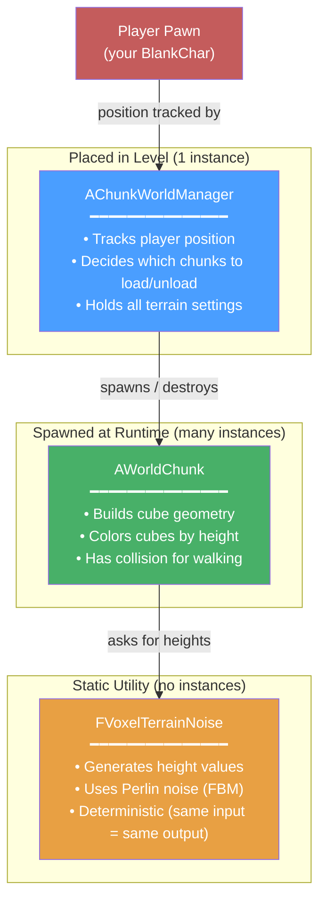
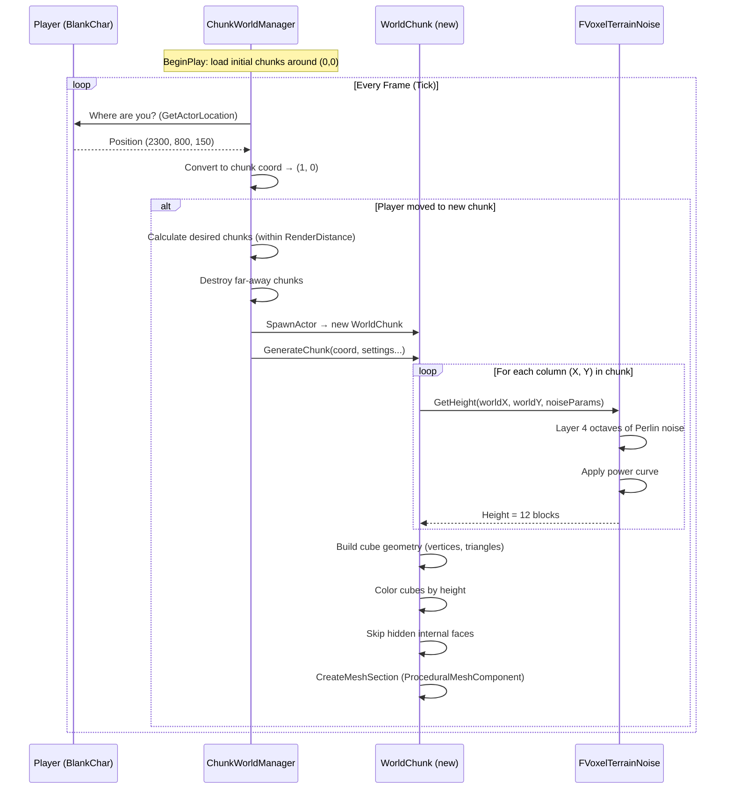

# Terrain Generation System

A guide to how the procedural chunk-based voxel terrain works in this project.

---

## Overview

The terrain system generates an infinite-feeling world made of **colored cubes** (voxels), similar to Cube World. Instead of building the entire world at once, the system divides the world into **chunks** — square tiles of terrain — and only generates the ones near the player. As the player moves, new chunks appear ahead and old ones are destroyed behind.

Three C++ classes work together to make this happen:



---

## The Three Classes

### 1. `AChunkWorldManager` — The Brain

**Files**: [ChunkWorldManager.h](file:///e:/UnrealProjects/cube-world/Source/CubeWorld/ChunkWorldManager.h) · [ChunkWorldManager.cpp](file:///e:/UnrealProjects/cube-world/Source/CubeWorld/ChunkWorldManager.cpp)

**What it is**: An `AActor` you place once in your level. Think of it as the **director** — it doesn't draw anything itself, but tells chunks when to appear and disappear.

**Responsibilities**:
- Every frame (`Tick`), checks where the player is standing
- Converts the player's world position into a **chunk coordinate** (a grid cell)
- If the player entered a new chunk cell, triggers an update:
  - **Load** chunks within `RenderDistance` that aren't loaded yet
  - **Unload** (destroy) chunks that are now too far away
- Stores all terrain settings (noise parameters, chunk size, etc.) and passes them to each new chunk

**How chunk coordinates work**:

```
World Space (Unreal Units)          Chunk Coordinates
┌─────────────────────────┐         ┌───┬───┬───┐
│                         │         │   │   │   │
│  Player at (2300, 800)  │  ───►   │0,0│1,0│2,0│  ◄── Player is in chunk (1, 0)
│         ★               │         │   │ ★ │   │
│                         │         ├───┼───┼───┤
│                         │         │   │   │   │
│  ChunkSize=16           │         │0,1│1,1│2,1│
│  VoxelSize=100          │         │   │   │   │
│  → Each chunk = 1600 UU │         └───┴───┴───┘
└─────────────────────────┘
```

The conversion is simple: `ChunkCoord = Floor(WorldPosition / (ChunkSize × VoxelSize))`

**Key properties you can tweak in the Details panel**:

| Property | What it controls |
|----------|-----------------|
| `ChunkSize` | How many cubes wide each chunk is (default: 16) |
| `VoxelSize` | World-space size of one cube in UU (default: 100) |
| `RenderDistance` | How many chunks to keep loaded around the player (default: 5) |
| `Frequency` | Noise scale — lower = bigger, smoother hills (default: 0.004) |
| `Amplitude` | Maximum terrain height in cube-columns (default: 30) |
| `Seed` | Change this for a completely different landscape |

---

### 2. `AWorldChunk` — The Builder

**Files**: [WorldChunk.h](file:///e:/UnrealProjects/cube-world/Source/CubeWorld/WorldChunk.h) · [WorldChunk.cpp](file:///e:/UnrealProjects/cube-world/Source/CubeWorld/WorldChunk.cpp)

**What it is**: An `AActor` spawned at runtime by the manager. Each chunk contains a `UProceduralMeshComponent` — a special UE component that lets you build 3D geometry from code (vertices, triangles, normals, colors) instead of importing a mesh from a 3D editor.

**Responsibilities**:
- When `GenerateChunk()` is called, it builds the 3D mesh for its area:
  1. **Samples heights** for a grid of columns using `FVoxelTerrainNoise`
  2. **Stacks cubes** from ground level up to the sampled height
  3. **Skips hidden faces** between adjacent solid cubes (optimization)
  4. **Colors each cube** based on its height (green → brown → grey → white)
  5. **Enables collision** so the player can walk on the terrain

**How a chunk builds its mesh**:

```
Height samples from noise:          Resulting cube columns:
                                    
  X=0  X=1  X=2  X=3                      ┌─┐
   3    5    4    2                    ┌─┐  │ │  ┌─┐
                                 ┌─┐  │ │  │ │  │ │
                                 │ │  │ │  │ │  └─┘
                                 │ │  │ │  └─┘
                                 └─┘  └─┘
                                 ▀▀▀▀▀▀▀▀▀▀▀▀▀▀▀▀▀  ground
```

**Face culling — why it matters**:

A naive approach would draw all 6 faces of every cube (6 faces × 2 triangles × 3 vertices = 36 vertices per cube). With a 16×16 chunk that's 30 blocks tall, that's potentially **276,480 vertices** per chunk!

Instead, we skip any face that touches another solid cube — you'd never see it anyway:

```
Before culling:        After culling:
┌──┬──┐                ┌─────┐
│  │  │                │     │
├──┼──┤        →       │     │
│  │  │                │     │
└──┴──┘                └─────┘
(12 faces)             (8 faces, inner walls removed)
```

This typically reduces vertex count by **60-80%**.

**Height-based coloring**:

```
Height ────────────────────────────────────────►

 Low          Mid-Low         Mid-High        High
 ┌──────────┬──────────────┬─────────────┬──────────┐
 │  Deep    │  Light Green │  Brown      │  Grey →  │
 │  Green   │  (meadows)   │  (earth)    │  White   │
 │ (grass)  │              │  (hills)    │ (snow)   │
 └──────────┴──────────────┴─────────────┴──────────┘
  0%        25%            50%    70%   85%     100%

 + subtle per-cube random variation for a hand-painted feel
```

---

### 3. `FVoxelTerrainNoise` — The Mathematician

**Files**: [VoxelTerrainNoise.h](file:///e:/UnrealProjects/cube-world/Source/CubeWorld/VoxelTerrainNoise.h) · [VoxelTerrainNoise.cpp](file:///e:/UnrealProjects/cube-world/Source/CubeWorld/VoxelTerrainNoise.cpp)

**What it is**: Not an actor — it's a plain C++ `struct` with `static` functions. It has no state, no instances, no presence in the level. It's a pure math utility.

**Responsibilities**:
- Given an (X, Y) world position, return a height value
- Uses **Fractal Brownian Motion (FBM)** — layered Perlin noise for natural-looking terrain

**Why not just use raw Perlin noise?**

Raw Perlin noise produces smooth, blobby hills — not very interesting. FBM layers multiple "octaves" of noise at different scales:

```
Octave 1 (big features):        Octave 2 (medium details):
~~~~~~~~~~                       ∿∿∿∿∿∿∿∿∿∿∿∿∿∿∿∿∿∿∿∿
     ╱    ╲                        ╱╲  ╱╲    ╱╲
   ╱        ╲      ╱             ╱    ╲╱  ╲╱╱  ╲╱╲
──╱          ╲────╱            ──                    ──

Octave 3 (fine detail):          Combined (FBM):
∿∿∿∿∿∿∿∿∿∿∿∿∿∿∿∿∿∿∿∿∿∿           ╱╲
╱╲╱╲╱╲╱╲╱╲╱╲╱╲╱╲╱╲╱╲╱╲         ╱╱  ╲╲    ╱╲
                               ╱╱    ╲ ╲╱╱╲ ╲╱╲
                             ──╱      ╲──    ╲    ──
                                  Mountains!
```

Each octave is:
- **Higher frequency** (smaller features) — controlled by `Lacunarity`
- **Lower amplitude** (less influence) — controlled by `Persistence`

A **power curve** is applied at the end (`pow(noise, 1.4)`) to make flat plains more common and tall mountains rarer — just like real terrain.

---

## How They Work Together — Full Flow



---

## Key UE Concepts Used

| Concept | Where used | What it means |
|---------|-----------|---------------|
| `AActor` | Manager, Chunk | Base class for anything placed/spawned in a level |
| `UProceduralMeshComponent` | Chunk | Component that builds 3D mesh from arrays of vertices/triangles in code |
| `Tick(DeltaTime)` | Manager | Function called every frame — used to check player position |
| `SpawnActor` / `Destroy` | Manager | Create/delete actors at runtime |
| `UPROPERTY(EditAnywhere)` | Manager | Exposes a C++ variable in the UE Details panel for easy tuning |
| `TMap<FIntPoint, AWorldChunk*>` | Manager | Hash map storing which chunks are loaded, keyed by grid coordinate |
| Vertex Colors | Chunk | Per-vertex color data baked into the mesh (needs a material that reads it) |
| Clockwise winding | Chunk | UE/DirectX requires CW triangle winding for front-facing surfaces |

---

## File Map

```
Source/CubeWorld/
├── ChunkWorldManager.h/.cpp   ← Place in level, drives everything
├── WorldChunk.h/.cpp          ← Spawned per chunk, builds cube mesh
├── VoxelTerrainNoise.h/.cpp   ← Pure math, no UE dependencies beyond FMath
├── BlankChar.h/.cpp           ← Your player character (not part of terrain)
├── CubeWorld.Build.cs         ← Added "ProceduralMeshComponent" module here
└── ...
```
