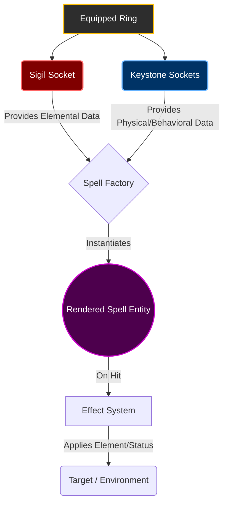
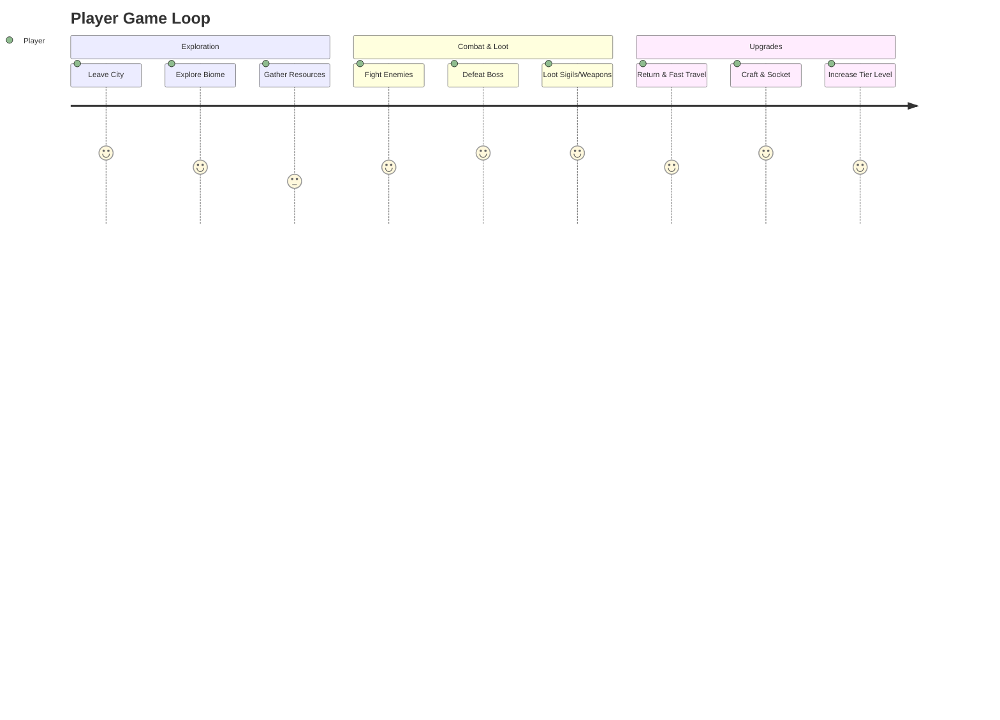

# Cube World (Working Title)

A fast-paced, cooperative Action RPG set in a procedurally-inspired blocky, non-flat open world. **Cube World** focuses heavily on fluid, responsive gameplay, combining martial combat with a deeply modular, loot-driven magic system.

---

## 🌟 Core Features

- **Dynamic Open World**: Explore vivid biomes (forests, plains, snow) in a stylized, non-flat blocky environment.
- **Deep ARPG Progression**: Loot-driven equipment, tiers that scale with distance from cities, and an economy driven by gathering and crafting.
- **Classless Freedom**: No rigid class system. Mix and match martial weapons (Swords, Bows, Lances) with spellcasting.
- **Modular Magic System**: Build your own spells from scratch using scattered loot components (Sigils and Keystones).
- **Seasonal Leagues**: Ongoing content updates and ladders.
- **Co-op Focused**: Designed for cooperative gameplay, but completely soloable. 

---

## 🔮 The Modular Magic System

Magic in Cube World is not learned from a skill tree; it is **built and socketed** like a weapon. Every spell used by the player (and enemies) is dynamically assembled using a pure Data-Driven architecture under the hood.

There are two main branches of magic:
* **Inner Magic**: Used by martial artists to enhance their bodies and weapons.
* **Outter Magic**: Used by wizards to influence the environment via a catalyst.

### How Spells Are Assembled

Spells are forged using three main components dropped as loot:

1. **💍 Ring (The Vessel)**: The base item equipped by the player containing sockets.
2. **🔥 Sigil (The "What")**: Determines the elemental payload (Fire/Ice, Earth, Light, Dark). 
3. **✨ Keystone (The "How")**: Determines the physical form, trajectory, size, and trigger of the spell (e.g., Cone, Wall, Homing, Orbiting).

*Example: Socketing an `Ice Sigil`, a `Caster-Target Keystone`, and a `Circular Trajectory Keystone` creates a defensive barrier of ice cubes that permanently orbit the player!*

---

## ⚔️ Combat & Archetypes

Gameplay is the primary focus. Movement must feel incredible—running, jumping, and blending animations smoothly is the top priority for early development.

While there are no set classes, players naturally lean into archetypes based on their loadouts:
* **Martial Artists**: Warriors, Archers, Lancers, Assassins. (Using Bows, Swords, Shields, Daggers)
* **Magic Users**: Casters, Healers, Buffers. (Using Wands, Staffs, Catalysts)

---

## 🗺️ Progression & World

* **Tiered Difficulty**: Enemies, loot, and spell components reach higher tiers the further you travel from a city.
* **Fast Travel**: Easily teleport to your last visited city at any time, or travel between cities using specific resources.
* **The Story Arc**: A classic Isekai trope—summoned to defeat a great evil... only to discover those who summoned you are exploiting the world. Features a time-travel "Hardmode" upon reaching the climax.

---

## 🛠️ Development Roadmap

- [x] **Core Movement**: Third-person character with procedural movement blending (Walk, Run, Dash, Jump).
- [ ] **Environment Blockout**: Basic terrain, biome setups, and skybox.
- [ ] **Basic Enemies & Combat**: Hitboxes, HP UI, sound effects, and standard enemy AI.
- [ ] **Inventory & Items**: Base items, UI bars, and base weapon types (Bow, Dagger, Staff, etc.).
- [ ] **Magic System Core**: Spell Factory implementation, basic Keystone forms (Cube, Wall, Aura), and initial Sigils (Fire/Ice).
- [ ] **RPG Elements**: Player attributes (Str, Dex, Int, Luck), simple weapon affixes.
- [ ] **Skill System**: Active/Passive skill UI and initial attack animations.
- [ ] **Advanced AI (R&D)**: Integration of LLM agents for natural, memory-driven NPC interactions.

---
*Created in Unreal Engine 5. Focus is on smooth mechanics over next-gen visuals.*
